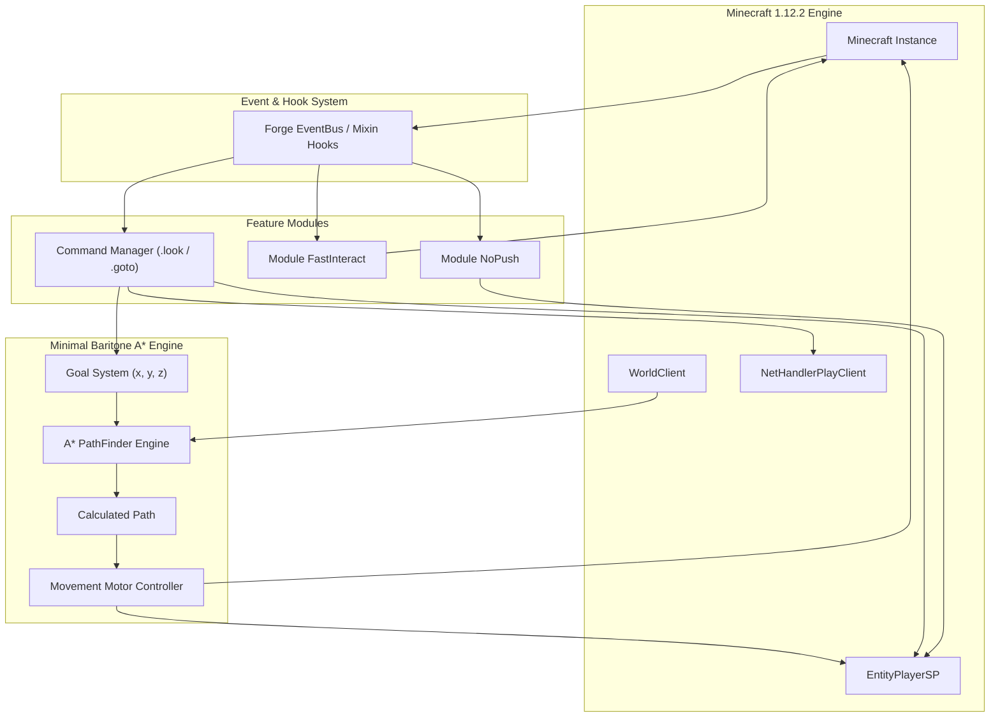
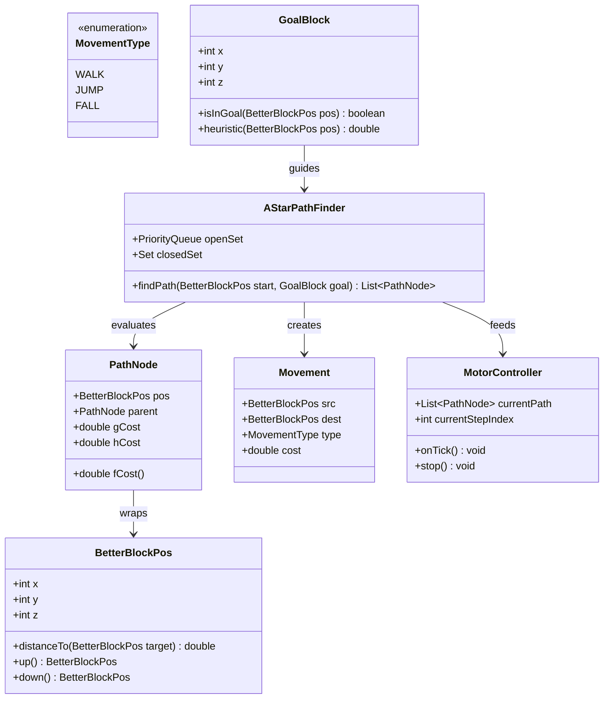

# Đặc tả Kỹ thuật Hệ thống — Minimal Utility Client & Baritone A* (1.12.2)

Version: 1.0 | Date: 2026-10-09 | Status: PROPOSED  
Tác giả: Omni-IT Architect

---

## 1. Tổng quan & Mục tiêu Dự án

### 1.1 Mục tiêu
Tách và xây dựng bộ source code độc lập, tinh gọn, sạch sẽ từ yêu cầu client Minecraft 1.12.2:
1. **NoPush**: Chống bị đẩy lùi bởi Entity (người chơi, mob), dòng nước/chất lỏng (Liquids), và khi kẹt trong block.
2. **FastInteract / FastUse**: Triệt tiêu cooldown nhấp chuột phải (`rightClickDelayTimer = 0`), hỗ trợ đặt block và sử dụng vật phẩm siêu tốc.
3. **.look Command**: Lệnh điều khiển và khóa góc quay camera/player (`.look <pitch> <yaw>` hoặc `.look <yaw> <pitch>`) với đồng bộ packet `CPacketPlayer.Rotation`.
4. **Minimal Baritone A* Engine**: Tinh chế 100% thuật toán tìm đường A* 3D từ Baritone chuyên dụng cho địa hình Minecraft, loại bỏ sạch các phân hệ thừa (`#sel`, `#build`, `#mine`, schematics, caching phức tạp), chỉ giữ lại duy nhất chức năng và lệnh `#goto <x> <y> <z>` kèm bộ điều khiển di chuyển (Motor Controller).

### 1.2 Phạm vi hệ thống
- **Nền tảng mục tiêu**: Minecraft 1.12.2 (Java 8).
- **Hình thức**: Mod Forge 1.12.2 độc lập kèm Gradle wrapper sẵn sàng build `gradlew build`.

---

## 2. Phân rã Chức năng Nguyên tử (Functional Decomposition)

Hệ thống được chia thành 6 phân hệ với 26 chức năng nguyên tử (Atomic Functions):

```
Hệ thống: Minimal Utility Mod + Baritone A* (26 functions)
├── Phân hệ 1: Khung điều khiển & Hook Sự kiện (Core & Event Bus) (4 functions)
│   ├── 1.1 Đăng ký Mod & Khởi tạo Event Bus
│   ├── 1.2 Đón chặn sự kiện Client Tick (TickEvent.ClientTickEvent)
│   ├── 1.3 Đón chặn sự kiện Render 3D (RenderWorldLastEvent)
│   └── 1.4 Đón chặn sự kiện Gửi tin nhắn Chat (ClientChatEvent)
├── Phân hệ 2: Module NoPush (Chống Xô Đẩy) (4 functions)
│   ├── 2.1 Hủy vector lực đẩy từ Entity khác (PlayerSP.applyEntityCollision)
│   ├── 2.2 Hủy lực đẩy từ dòng nước và dung nham (BlockLiquid / pushOutOfBlocks)
│   ├── 2.3 Hủy cơ chế đẩy ra khi kẹt trong khối (pushOutOfBlocks)
│   └── 2.4 Bật/Tắt module NoPush qua cấu hình hoặc lệnh
├── Phân hệ 3: Module FastInteract / FastUse (3 functions)
│   ├── 3.1 Reset biến đếm trễ chuột phải (Minecraft.rightClickDelayTimer = 0)
│   ├── 3.2 Tối ưu hóa chu kỳ đặt block liên tục (Fast Placement)
│   └── 3.3 Bật/Tắt module FastInteract qua lệnh
├── Phân hệ 4: Hệ thống Lệnh & Module Look (.look Pitch Yaw) (4 functions)
│   ├── 4.1 Phân tích cú pháp lệnh tiền tố .look (Command Parser)
│   ├── 4.2 Validate giá trị Yaw (-180° đến 180° / 360°) và Pitch (-90° đến 90°)
│   ├── 4.3 Cập nhật góc quay Client Camera (rotationYaw, rotationPitch)
│   └── 4.4 Gửi gói tin cập nhật hướng nhìn lên Server (CPacketPlayer.Rotation)
├── Phân hệ 5: Thuật toán Tìm đường A* Tinh gọn (Minimal Baritone A*) (6 functions)
│   ├── 5.1 Khởi tạo mục tiêu tọa độ GoalBlock(x, y, z)
│   ├── 5.2 Xây dựng hàm Heuristic Manhattan/Euclidean 3D
│   ├── 5.3 Tính toán chi phí di chuyển Voxel (Đi bộ, Nhảy 1 block, Rơi an toàn)
│   ├── 5.4 Kiểm tra va chạm khối & khả năng đi xuyên (Passable / Solid block check)
│   ├── 5.5 Vòng lặp tìm kiếm Node tối ưu bằng PriorityQueue (OpenSet / ClosedSet)
│   └── 5.6 Truy vết ngược (Backtrack) để tạo danh sách Node đường đi hoàn chỉnh
└── Phân hệ 6: Điều khiển Động cơ Di chuyển (Motor Controller) (5 functions)
    ├── 6.1 Nhận lệnh goto và kích hoạt luồng tính toán đường đi
    ├── 6.2 Tính vector hướng di chuyển từ vị trí hiện tại đến Node kế tiếp
    ├── 6.3 Điều khiển phím di chuyển W/A/S/D và Nhảy (KeyBinding emulation)
    ├── 6.4 Nhận diện chướng ngại vật & tự động hủy/re-calc đường đi khi tắc
    └── 6.5 Xác nhận hoàn thành mục tiêu khi player chạm tọa độ x, y, z
```

**TỔNG KẾT NGUYÊN TỬ:**
- Phân hệ 1: Core & Event Bus — 4 functions
- Phân hệ 2: NoPush — 4 functions
- Phân hệ 3: FastInteract — 3 functions
- Phân hệ 4: Look Command — 4 functions
- Phân hệ 5: Minimal Baritone A* Engine — 6 functions
- Phân hệ 6: Motor Controller — 5 functions
- **TỔNG CỘNG: 26 functions**

---

## 3. Thiết kế Kiến trúc Hệ thống

### 3.1 Mô hình Kiến trúc
Sử dụng kiến trúc **Modular Event-Driven Architecture** trên nền tảng Minecraft Forge 1.12.2 kết hợp Mixin/Reflection:



---

## 4. Mô hình Dữ liệu Cốt lõi (Data Model)



---

## 5. Đề xuất Tech Stack & Tùy chọn Triển khai

| Tiêu chí | Lựa chọn 1 (Khuyên dùng) | Lựa chọn 2 |
|:---|:---|:---|
| **Mô hình** | **Forge 1.12.2 Standard Mod + ForgeGradle** | **Cleanroom / Modern 1.12.2 Forge** |
| **Build Tool** | Gradle 4.9 / 4.10.3 + Java 8 | Gradle 7+ / 8 (Cleanroom MC Forge) |
| **Hook Mechanism** | Forge Event Handler + Reflection / AccessTransformer | SpongePowered Mixin 0.7+ |
| **Ưu điểm** | Tương thích 100% mọi launcher MC 1.12.2, build đơn giản, gọn nhẹ | Code can thiệp sâu hơn mà không cần Reflection |
| **Nhược điểm** | Cần AccessTransformer hoặc Reflection cho một số trường private | Cần setup cấu hình Mixin phức tạp hơn |
